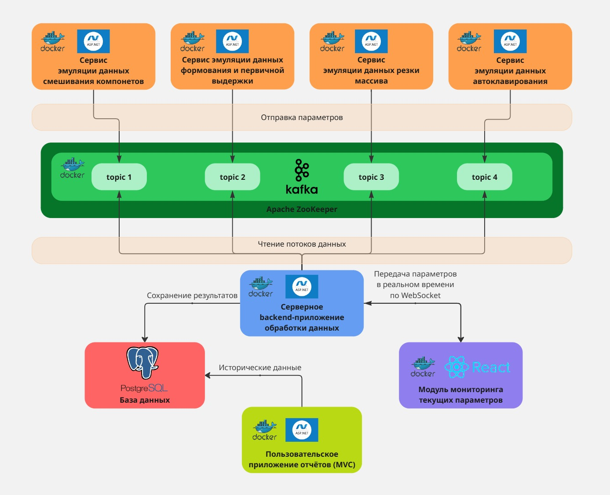

# Automated-industrial-production-system

## 📌 Описание

Автоматизированная система реального времени для мониторинга параметров производства газобетонных блоков.
Она предназначена для имитации и анализа этапов технологического процесса на основе потоковой обработки данных в реальном времени.
Система обеспечивает сбор, передачу, хранение и визуализацию данных, а также формирование отчётов об этапах процесса.

---

## 🛠 Стек
<div align="center">
  
  
  
  
  
  
  
</div>

---

## 🏗 Архитектура проекта



## 🧩 Компоненты системы

1. **Модули эмуляции данных** (Docker + ASP.NET Core)  
   - Генерируют параметры по методу Монте-Карло для каждого этапа технологического процесса.
   - Работают как продюсеры Kafka.

2. **Система передачи сообщений** — **Apache Kafka + Zookeeper**  
   - Брокер сообщений для обработки событий в реальном времени.
   - Тематически разделён на `topic1`, `topic2`, `topic3`, `topic4`.

3. **Сервер обработки данных** (ASP.NET Core, Docker)  
   - Является единственным консюмером Kafka.
   - Обрабатывает данные, передаёт их по WebSocket и сохраняет в базу данных.

4. **Модуль мониторинга параметров** (React + WebSocket + Docker)  
   - Отображает текущие параметры в реальном времени.

5. **База данных** (PostgreSQL)  
   - Хранит исторические данные о параметрах технологических этапов.

6. **Пользовательское приложение** (ASP.NET MVC, Docker)  
   - Позволяет просматривать отчёты, логи ошибок и статистику на основе истории данных.

---

## 🔄 Общий процесс работы

1. Модули-эмуляторы генерируют данные параметров этапа (по методу Монте-Карло).
2. Отправка параметров в соответствующие Kafka topics.
3. Серверное приложение обрабатывает данные и:
   - сохраняет в PostgreSQL;
   - отправляет текущие данные на клиент через WebSocket.
4. Клиентская часть визуализирует данные в реальном времени.
5. После завершения этапа доступна аналитика и отчёты в пользовательском приложении MVC.

---

## 🚀 Запуск проекта

> Требуется установленный Docker и Docker Compose.

```bash
# Клонируем репозиторий
git clone https://github.com/korenevlad/Automated-industrial-production-system.git
cd Automated-industrial-production-system

# Сборка images
# Перейти в ./Consumer
docker build -t consumer .
# Перейти в ./Producers\MixingComponentsProducer
docker build -t mixing-components-producer .
# Перейти в ./Producers\MoldingAndInitialExposureProducer
docker build -t molding-and-initial-exposure-producer .
# Перейти в ./Producers\CuttingArrayProducer
docker build -t cutting-array-producer .
# Перейти в ./Producers\AutoclavingProducer
docker build -t autoclaving-producer .
# Перейти в ./Producers\ReportManager
docker build -t mvc-app .
# Перейти в ./Producers\Frontend
docker build -t frontend .

# Запуск системы
./start_services.ps1